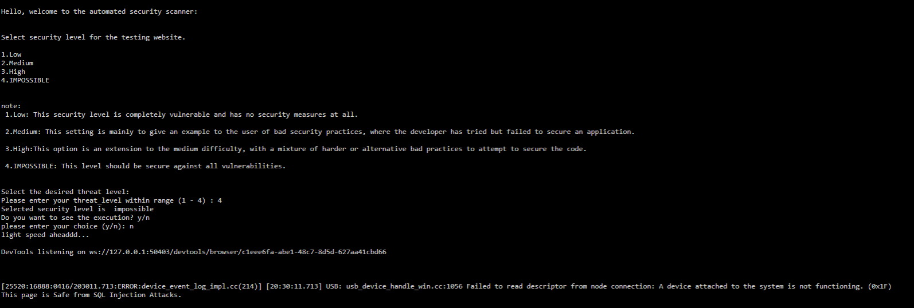
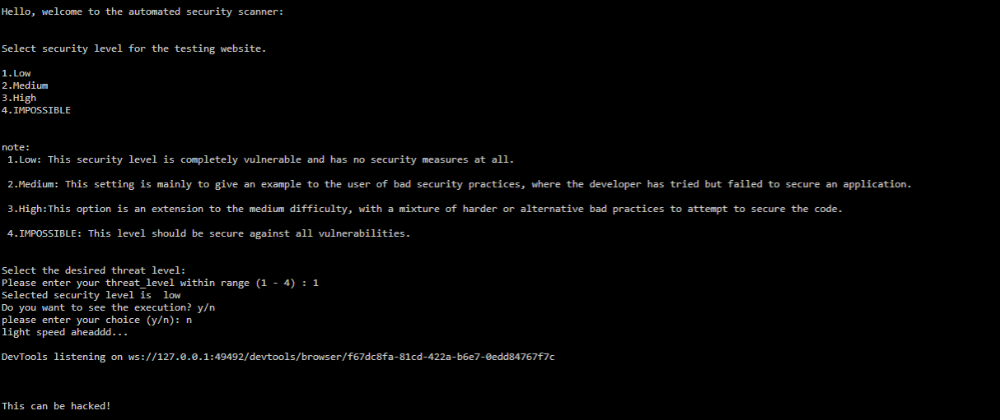

# Automated-OWASP-security-scanner
automation security scanner for sql injection and xss scanner
Web security is an important aspect for web applications. Today web security is a real concern related to the Internet. It is considered as the principal framework for the worldwide data society. Web applications provide a better interface for a client through a web page. The web page script gets executed on client web browser.
Web applications are a main base of attacks such as cross-site scripting, cookie-session theft, browser attack, self-propagating worms in web email and web sites. These types of attacks are called ‘injection attacks’ which attacks by the use of malicious code. Injection attacks have commanded the highest point of web application vulnerability lists for a significant part of the previous decade.
There are two most common security vulnerabilities today: SQL injection and cross-site scripting. A security evaluation of application defence centre, which had more than 250 e-commerce applications, online banking and the corporate sites came up with a statement that more than 85% of web applications are vulnerable to attacks.
  
## About OWASP 
The Open Web Application Security Project (OWASP) is a non-profit organisation dedicated to improving software security. The OWASP Foundation is the source for developers and technologists to protect the internet, with community-led open-source software initiatives, many local structures around the world, a vast number of participants, and leading educational and training conferences. 

- Resources and Tools

- Collaboration and Networking

- Training & Education 

The Scanner for OWASP vulnerabilities is used to detect the bug and vulnerabilities that the websites display about the kinds of vulnerabilities in them. As we all know, over the last decade, organisations have been affected by an ever-increasing number of status data breaches. A large number of them are so-called "injection attacks," in which malicious code is injected into an online application. Indeed, according to OWASP, a web application security organisation, “How data input is managed by Web applications is arguably the most important aspect of security.”  

## About Project Development 
Python and its various modules are used to develop this project. For the QT front end, it is the latest and most visually attractive python tool. 
### python 
Python is a language of interpretation, high quality and general use. With his remarkable application of important whitespace, Python's design philosophy emphasises code readability. Its language structures and object-oriented approach are aimed at allowing programmers to produce clear and logical code for large and small projects. 
Python is a language of multiple paradigms. Object-oriented and structured programming are fully supported, and several of their features support functional programming and aspect-oriented (including metaprogramming and metapointing) programming. Many other paradigms, including contract design and logic programming, are supported through extensions. 
This language has been chosen for its modularity and its easy reading and a vast community of help and support 

- Beautiful Soup Module 
 
- URL module to join 

- cProfile module for the performance measurement 

- Facing design QT 

- OS: separate OS. 
## Modules of project 
The design of software sits on the software system technique kernel and is applied irrespective of event paradigm and application space. Style is that any built product or system begins during the development phase. The designer's objective is to provide a model or illustration of an entity that is to be developed later. Initially, once the demand for the system is fixed and the style of the system is analysed, the first of three technical activities is to design, code and take a look at software system design and verification. 

- Sql py module 
 
- Xss module 

- Broken authentication module 
## ENTITY RELATIONSHIP DIAGRAMS 
An ER model is an abstract way to describe a database. 
//IMAGE// 
## USECASE DIAGRAM: 
It is important to consider use case diagram in the planning of an economical and efficient healthcare partner system. The case diagram for use is one of the 5 YML diagrams or modelling the system dynamics. Case diagram for modelling a system, system or category comportement is central. Use case diagrams are very important for the visualisation, specification and creation of approachable systems, systems and subsystems and categories, and they can be used in context. 
// IMAGE// 
## PHYSICAL SYSTEM DESIGN
The work system is created by defining design requirements that tell the programmers precisely what the applicant system has to do. 
## ARCHITECTURAL DESIGN 
Architectural style can be an overview of its type and structure and the ways in which its components match. The style of study can be a package element, one thing as easy as the programming module, but it could be extended to include information and middleware that changes the shopper and server network configuration. There are several modules in this project. The Admin module supports the management of the entire website. The manager may decide that the complaint should be read by the department. 
## INTERFACE DESIGN 
An effective communication media between a human and computer is created by the interface design. The communication between the administrator and the commissioning station is part of this project. As a database is necessary for this project, clients' machines have to be connected to the server host. Through the user friendly web pages, users interact with the software. 
//IMAGE// 
## RESULTS
 
- SQLi Output 

 

- XSS Output 

 

## FUTURE ENHANCEMENT 
In one step, nothing can be achieved. It's just that during this world nothing is permanent. In addition, this project has further improvements in the evergreen and booming trade in IT. Change is unavoidable. The "OWASP Scanner of Vulnerabilities" project was developed and tested successfully. The system and thus the design square are compatible and can therefore lead to abundant problems by adding the latest modules. Since this module has its characteristic characteristics, it can extend it to make a whole technique. 

